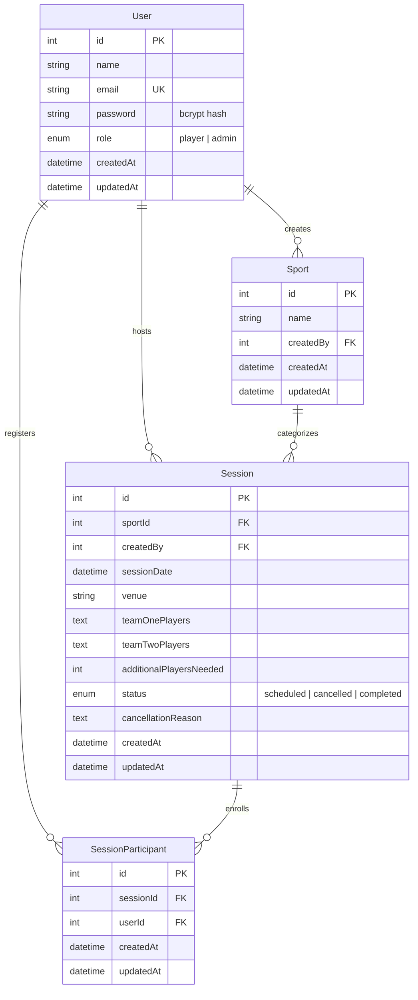

# Sports Scheduler 🏆

> **Plan. Play. Connect.** — An enterprise-grade, full-stack sports session coordination and community management platform.

[](https://nodejs.org/)
[](https://expressjs.com/)
[](https://sequelize.org/)
[](https://www.postgresql.org/)
[](LICENSE)

---

## 📌 Executive Summary

**Sports Scheduler** is a web platform engineered for sports communities, campus intramurals, recreational clubs, and athletic coordinators. Organizing pickup and competitive games often suffers from coordination bottlenecks: double-booking conflicts, lack of headcount visibility, messy participant tracking, and abrupt cancellations without rationale.

Sports Scheduler provides a robust solution featuring **server-side interval conflict detection**, **dual-role admin participation**, **safe cascading entity lifecycles**, **analytics reports**, and **state-aware dashboards** for both organizers and players.

---

## 🌟 Key Features & Architectural Highlights

### ⏱️ 1. Intelligent Session Time-Conflict Engine
- **Interval Overlap Prevention**: Implements server-side temporal validation based on standard 1-hour session durations.
- **Mathematical Overlap Detection**: Uses interval intersection logic `(StartA < EndB) && (StartB < EndA)` to evaluate conflicts across all enrolled sessions regardless of sport.
- **Touching Endpoint Allowance**: Back-to-back sessions (e.g., 10:00–11:00 AM and 11:00–12:00 PM) are permitted, while overlapping sessions (e.g., 10:00–11:00 AM and 10:30–11:30 AM) are blocked.
- **Enforced Universally**: Applied during player session creation, admin session creation, and player session join actions.

### 👥 2. Admin Dual-Role Architecture
- **Complete Parity**: Administrators are fully empowered players who can switch between the **Admin Console** and **Player Mode** with one click.
- **Creator Self-Participation**: Admins and players can select *"I'm playing in this game"* during creation to automatically reserve their spot on the roster.
- **Unified Action Set**: Admins can discover, view details, join open games, and cancel sessions across the platform.

### 🛡️ 3. Safe Sport Lifecycle & Deletion Protection
- **Zero-Dangling Integrity**: Admins can only delete sports that have `0` associated sessions in the database.
- **Informative Rejection**: If sessions exist for a sport, deletion is rejected with a clear message indicating how many dependent sessions remain.
- **Danger Zone Controls**: Clean confirmation modals and dedicated deletion controls on both the admin dashboard and sport edit views.

### 🔔 4. Four-Tier Flash Alert System
- **Contextual Visual Cues**: Custom-styled alert components with distinct visual hierarchies for **Success**, **Error**, **Warning**, and **Info**.
- **No Invisible Refreshes**: Resolved double-consumption lifecycle issues so validation failures always render immediately to the user.
- **Integrated Globally**: Rendered across login, registration, password updates, dashboard actions, and session detail workflows.

### 🧭 5. Unified Navigation & Account Popover
- **Global Header Partial**: Standardized navigation bar across all authenticated views.
- **Interactive Account Popover**: Displays user initials, full name, email, and explicit role badge (`Administrator` vs. `Player`), along with direct links to profile security and sign-out.

### 📊 6. Analytics & Popularity Reports
- **Dynamic Date Filtering**: Custom date range selection (start date to end date) with real-time validation.
- **Metrics Breakdown**: Tracks total scheduled vs. completed vs. cancelled sessions, total joined players, and seats needed.
- **Visual Distribution Bars**: Sport-by-sport share of total sessions and player participation volume.
- **Audit Table with Cancellation Reasons**: Transparent session logs highlighting host/admin cancellation reasons.

---

## 📐 Entity Relationship Architecture



---

## 💻 Tech Stack

| Layer | Component | Description |
| :--- | :--- | :--- |
| **Backend Runtime** | Node.js (v18+) | Asynchronous event-driven server runtime |
| **Web Framework** | Express.js (v5) | Routing, middleware chaining, and RESTful endpoints |
| **Database** | PostgreSQL | Relational storage with ACID compliance and SSL support |
| **ORM** | Sequelize (v6) | Data modeling, migrations, validation hooks, and relational associations |
| **Authentication** | Passport.js & Bcrypt | Session-based authentication with bcrypt hashing |
| **Templating** | EJS (Embedded JavaScript) | Reusable partials, semantic layouts, dynamic server-side rendering |
| **Design System** | Custom CSS3 | Modern variables, responsive grids, accessible contrast tokens |
| **Test Suite** | Node.js Test Runners | Automated unit and integration tests for conflict detection and deletion |

---

## 📁 Repository Structure

```
sports-scheduler/
├── config/
│   ├── auth/
│   │   └── passport.js          # Passport local strategy & serialization
│   └── config.js                # Database connection config (Development, Test, Production SSL)
├── middleware/
│   └── auth.js                  # requireAuth & requireAdmin route guards
├── migrations/                  # Sequelize schema migrations
├── models/
│   ├── index.js                 # Sequelize model loader & relationship associations
│   ├── user.js                  # User model with bcrypt password hashing
│   ├── sport.js                 # Sport model
│   ├── session.js               # Session model with status enum & cancellation fields
│   └── sessionparticipant.js    # Join table for session participation
├── public/
│   └── css/
│       └── style.css            # Global CSS design system and responsive styles
├── routes/
│   ├── admin.js                 # Admin dashboard, sport CRUD, reports
│   ├── auth.js                  # Login, registration, profile, password change
│   └── player.js                # Player dashboard, session creation, joining, cancelling
├── test/
│   ├── runAllTests.js           # Automated test suite orchestrator
│   ├── runConflictTest.js       # Time conflict detection test suite
│   └── runSportDeletionTest.js  # Safe sport deletion integration tests
├── utils/
│   └── conflictCheck.js         # Core interval overlap detection algorithm
├── views/
│   ├── admin/                   # Admin views (dashboard, create/edit sport, create session, reports)
│   ├── partials/                # Reusable partials (header, flash-messages)
│   ├── player/                  # Player views (dashboard, create session, session details)
│   ├── home.ejs                 # Public landing page with live upcoming sessions
│   ├── login.ejs                # User login page with structured flash alerts
│   ├── signup.ejs               # User registration page
│   └── profile.ejs              # Account settings & password update view
├── index.js                     # Server entry point, middleware stack, global route mount
└── package.json                 # Scripts and package dependencies
```

---

## 🚀 Local Setup & Installation

### Prerequisites
- **Node.js**: v18.0.0 or higher
- **PostgreSQL**: v13 or higher running locally or remotely

### 1. Clone the Repository
```bash
git clone https://github.com/NagatejaThippanaboina/sports-scheduler.git
cd sports-scheduler
```

### 2. Install Dependencies
```bash
npm install
```

### 3. Configure Environment Variables
Create a `.env` file in the project root:
```env
PORT=3000
NODE_ENV=development
POSTGRES_USER=postgres
POSTGRES_PASSWORD=your_postgres_password
POSTGRES_HOST=127.0.0.1
DATABASE_NAME=sports_scheduler_dev
SESSION_SECRET=your_long_random_session_secret_here
```

### 4. Run Migrations & Setup Database
```bash
npx sequelize-cli db:migrate
```

### 5. Run Automated Tests
```bash
npm test
```
*Executes all temporal conflict tests and safe sport deletion tests to verify database integrity.*

### 6. Start the Application
```bash
npm start
```
Access the application at `http://localhost:3000`.

---

## 🧪 Automated Testing

The project includes an automated test suite verifying business logic:

```bash
npm test
```

### Test Coverage Highlights:
1. **Interval Conflict Prevention (`test/runConflictTest.js`)**:
   - Blocks exact start-time collisions across different sports.
   - Blocks partially overlapping windows (e.g., 10:00–11:00 vs 10:30–11:30).
   - Blocks encompassing intervals (e.g., 09:30–10:30 vs 10:00–11:00).
   - Allows strictly touching endpoints (e.g., 10:00–11:00 and 11:00–12:00).
2. **Safe Sport Deletion (`test/runSportDeletionTest.js`)**:
   - Prohibits deleting a sport when dependent sessions exist in the database.
   - Successfully removes sports with zero dependent sessions.

---

## ☁️ Deployment Guide (Render)

This repository is optimized for deployment on **Render** using a Node.js Web Service and Render PostgreSQL:

### Step 1: Create a PostgreSQL Database on Render
1. Navigate to the [Render Dashboard](https://dashboard.render.com/).
2. Click **New +** → **PostgreSQL**.
3. Name the database (e.g., `sports-scheduler-db`) and select the Free or Starter tier.
4. Once provisioned, copy the **Internal Database URL** (or External URL if deploying across regions).

### Step 2: Create a Web Service on Render
1. Click **New +** → **Web Service**.
2. Connect your GitHub repository: `NagatejaThippanaboina/sports-scheduler`.
3. Configure the service settings:
   - **Environment**: `Node`
   - **Branch**: `main`
   - **Build Command**: `npm install`
   - **Start Command**: `npm start`
4. In the **Environment Variables** section, add:
   - `NODE_ENV`: `production`
   - `DATABASE_URL`: *(paste the PostgreSQL Connection String from Step 1)*
   - `SESSION_SECRET`: *(enter a strong 64-character random string)*
5. Click **Create Web Service**.

### Step 3: Run Database Migrations on Render
Open the **Shell** tab in your Render Web Service dashboard and run:
```bash
npx sequelize-cli db:migrate
```

Your production sports scheduler is now live and fully operational!

---

## 📷 View Showcase & User Flows

| View | Description | Key Elements |
| :--- | :--- | :--- |
| **Landing Page** | Public welcome page | Live database upcoming sessions, call-to-action buttons, zero-state fallback |
| **Authentication** | Sign in and registration | Two-column cards, instant flash alerts, password security |
| **Admin Console** | Complete management hub | Sport management, session scheduling, quick stats, player mode launcher |
| **Player Mode** | Participant dashboard | Filter by sport, available vs joined vs created tabs, time-conflict checks |
| **Session Details** | Match page | Real-time participant roster, spots left counter, cancellation audit |
| **Analytics Reports** | Engagement analytics | Custom date range filtering, popularity breakdown, cancellation logs |
| **Account Profile** | User security | Name/email identity details, secure password change with verification |

---

## 📄 License

Distributed under the ISC License. See `LICENSE` for details.
