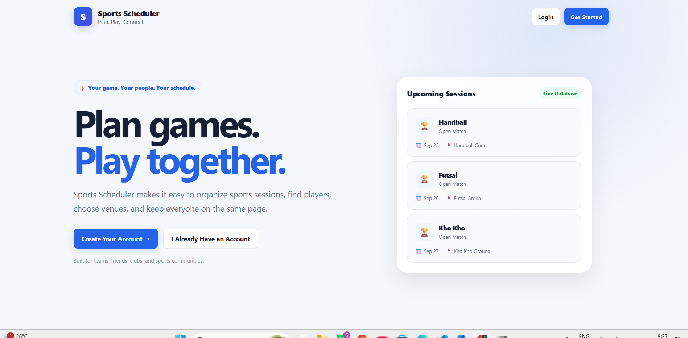
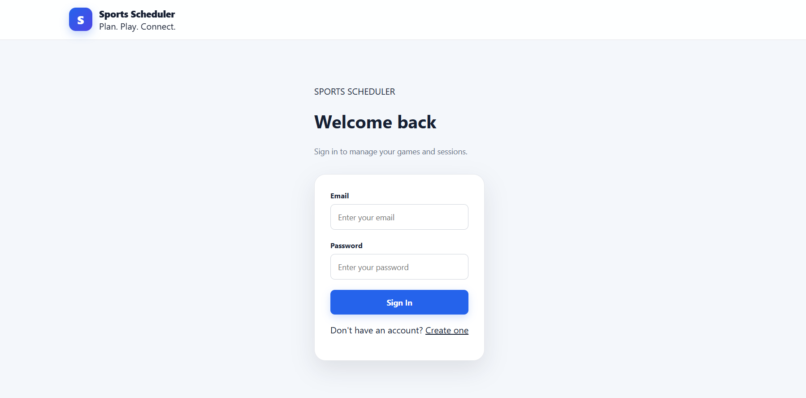
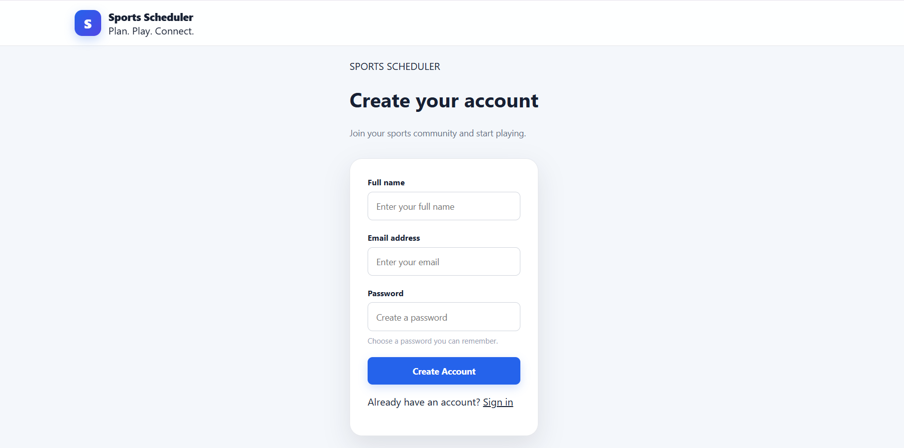
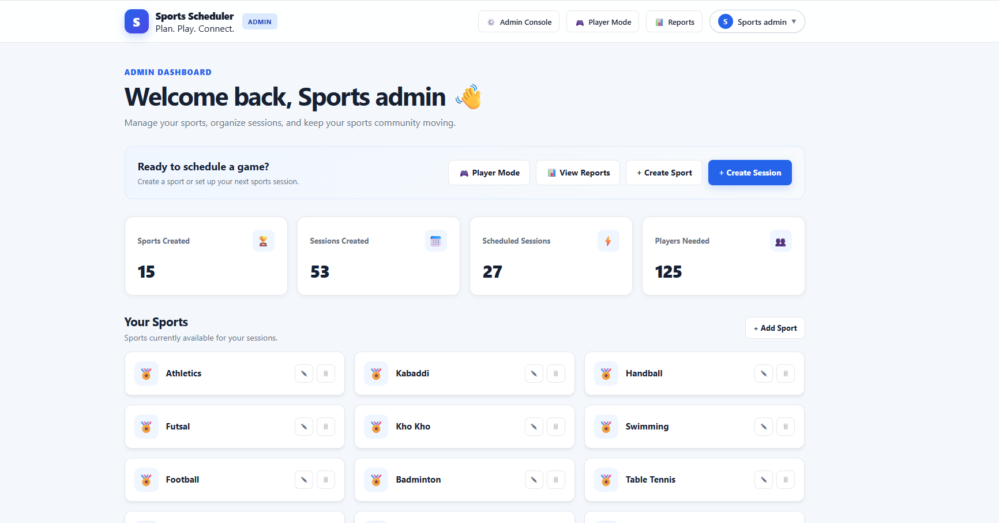
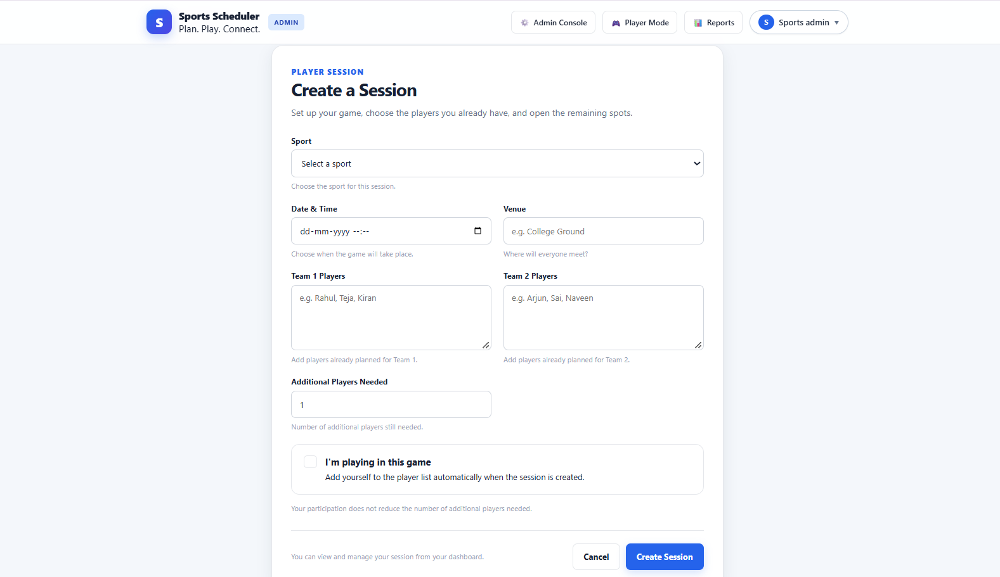
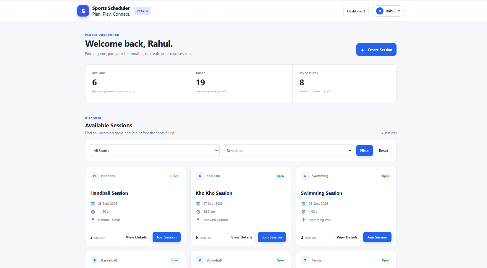
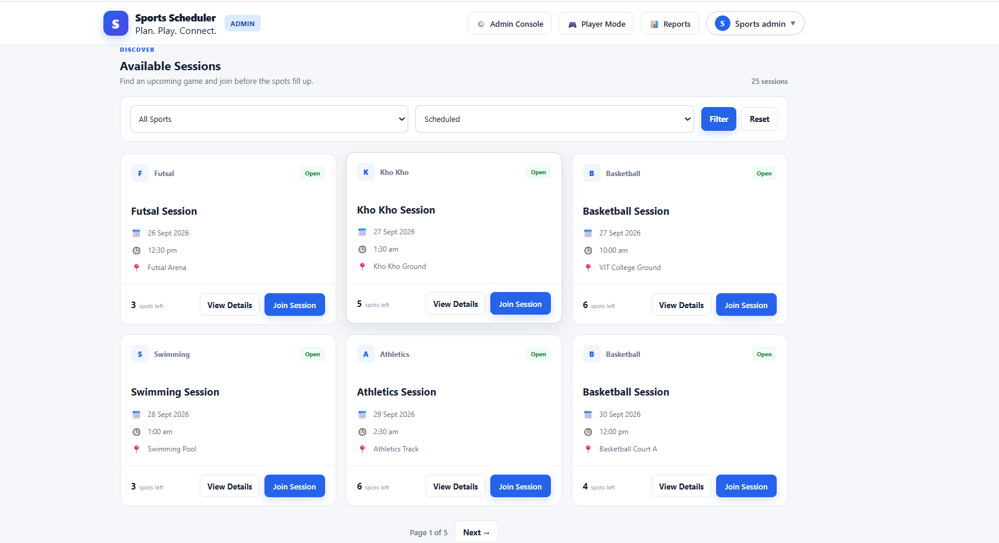
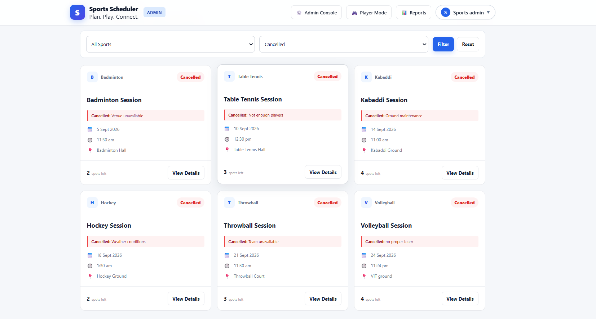
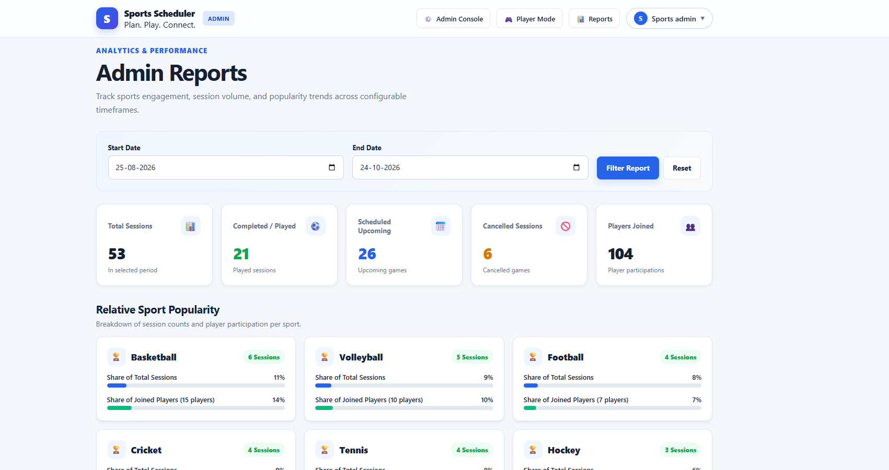

# 🏆 Sports Scheduler

> **Plan. Play. Connect.**

A full-stack sports session management platform built as the final capstone project for the **501 Web Development course**.

**Sports Scheduler** allows administrators to manage available sports and view reports, while players can create, discover, join, and manage sports sessions.

It is designed for **college communities, sports clubs, teams, friends, and recreational groups** that need a simple way to organize games and find players.

---

## 🌐 Live Application

**https://sports-scheduler-hiur.onrender.com/**

## 💻 GitHub Repository

**https://github.com/NagatejaThippanaboina/sports-scheduler**

---

# 📌 Project Overview

Sports Scheduler provides a centralized platform for organizing sports sessions instead of coordinating everything manually.

The application supports two main user roles:

* **Administrator** — manages sports, creates and participates in sessions, and views reports.
* **Player** — creates sessions, discovers available games, joins sessions, and manages their own sessions.

The project applies the backend, database, authentication, testing, security, frontend templating, and deployment concepts covered throughout the **501 Web Development course**.

---

# ✨ Key Features

## 👨‍💼 Administrator Features

### 🏟️ Sports Management

Administrators can:

* View available sports
* Create new sports
* Edit sports
* Delete sports when they have no dependent sessions
* Manage the sports available to players

The application currently supports sports including:

* Basketball
* Volleyball
* Cricket
* Tennis
* Football
* Badminton
* Table Tennis
* Kabaddi
* Hockey
* Throwball
* Handball
* Futsal
* Kho Kho
* Swimming
* Athletics

### 🎮 Admin Session Management

Administrators can also use the application as players.

They can:

* Create sport sessions
* Select a sport
* Set the date and time
* Specify a venue
* Add players to teams
* Specify additional players required
* Join sessions
* View session details
* Cancel sessions
* Switch between **Admin Console** and **Player Mode**

### 📊 Reports

Administrators can view reports for a configurable time period, including:

* Total sessions
* Scheduled sessions
* Completed sessions
* Cancelled sessions
* Player participation
* Sport popularity
* Cancellation information

---

# 👤 Player Features

## 🔐 Sign Up

New players can register using:

* Name
* Email address
* Password

Passwords are securely stored using **bcrypt hashing**.

## 🔑 Sign In

Existing users can sign in using their email address and password.

Authentication is implemented using **Passport.js** with session-based authentication.

## 🚪 Sign Out

Authenticated users can sign out and have their authentication session cleared.

## 🔄 Change Password

Authenticated users can change their own password.

The password is re-hashed using **bcrypt** before being stored.

Password changes are available to authenticated users without exposing or modifying another user's credentials.

## 🏟️ Create a Sport Session

Players can create a session by selecting:

* Sport
* Date
* Time
* Venue
* Team One players
* Team Two players
* Number of additional players required

Players can also participate in sessions they create.

## 🔎 Discover Sessions

Players can browse available sessions and view:

* Sport
* Date
* Time
* Venue
* Available spots
* Session status

Sessions can be filtered by sport and status.

## 🤝 Join Sessions

Players can open an available session and join it when spots are available.

After joining:

* Their participation is stored in the database.
* Their name becomes visible in the session roster.
* The session appears in their **Joined Sessions** section.
* Other users can see the updated participation.

Players cannot join sessions that have already passed.

## 📅 My Sessions

Players have separate sections for:

* **Joined Sessions** — sessions they are participating in.
* **Created By You** — sessions they have created.

## ❌ Cancel Sessions

Players can cancel sessions they created by providing a cancellation reason.

The cancellation reason is displayed to users who had previously joined the session, and cancelled sessions are clearly marked.

---

# 🧠 Additional Application Features

## ⏱️ Session Conflict Detection

Sports Scheduler includes server-side time-conflict detection.

Sessions use a standard one-hour duration for conflict checking.

The application detects overlapping sessions using interval comparison:

```text
(StartA < EndB) && (StartB < EndA)
```

For example:

```text
10:00 AM – 11:00 AM
10:30 AM – 11:30 AM
```

These sessions overlap and are rejected.

Back-to-back sessions are allowed:

```text
10:00 AM – 11:00 AM
11:00 AM – 12:00 PM
```

Conflict validation is applied when sessions are created and when users join sessions.

---

# 🔐 Authentication & Security

The project implements several security concepts covered in the 501 course:

* Passport.js authentication
* bcrypt password hashing
* Express sessions
* Cookies
* CSRF protection
* Authentication middleware
* Role-based authorization
* Protected routes
* Server-side validation
* Sequelize validations

Different application areas are protected according to the user's authentication status and role.

---

# 🔔 Flash Messages

The application uses contextual flash messages to provide feedback after user actions.

Messages are used for:

* Success
* Errors
* Warnings
* Information

They are integrated into authentication, registration, session creation, joining, cancellation, password changes, and other workflows.

---

# 🎓 501 Course Concepts Applied

Sports Scheduler was developed as the final capstone project for the **501 Web Development course**.

The course concepts were originally demonstrated through a Todo application. For the capstone, those concepts were applied to a complete sports-management application.

| 501 Concept              | Sports Scheduler Implementation          |
| ------------------------ | ---------------------------------------- |
| Node.js                  | Backend runtime                          |
| NPM                      | Dependency management and scripts        |
| package.json             | Project configuration                    |
| Event-driven programming | Node.js server architecture              |
| Closures                 | JavaScript programming concepts          |
| Callbacks                | Asynchronous programming                 |
| Promises                 | Asynchronous database operations         |
| async/await              | Database queries and route handlers      |
| Jest / Testing           | Automated application testing            |
| Git hooks                | Code-quality workflow                    |
| PostgreSQL               | Persistent relational database           |
| Sequelize                | ORM and database abstraction             |
| Sequelize Models         | User, Sport, Session, SessionParticipant |
| Sequelize Associations   | Relationships between entities           |
| Migrations               | Database schema management               |
| Express.js               | Web server and routing                   |
| Middleware               | Authentication and request processing    |
| MVC                      | Models, routes and EJS views             |
| EJS                      | Dynamic server-side HTML rendering       |
| HTML Forms               | Authentication and application forms     |
| APIs                     | Client/server request handling           |
| CSRF Protection          | Protection for state-changing requests   |
| Passport.js              | User authentication                      |
| bcrypt                   | Password hashing                         |
| Cookies                  | Browser session state                    |
| Sessions                 | Authenticated user state                 |
| Connect Flash            | One-time user feedback                   |
| Sequelize Validation     | Application/database validation          |
| Git & GitHub             | Version control                          |
| Cloud Deployment         | Render deployment                        |

This project therefore extends the learning from the 501 Todo application into a larger, role-based, database-driven web application.

---

# 🗃️ Database Design

Sports Scheduler uses **PostgreSQL** with **Sequelize**.

The production database is hosted using **Neon PostgreSQL**, while the web application is deployed on **Render**.

### Main relationships

```text
User
 │
 ├── creates ──> Sport
 │
 ├── creates ──> Session
 │
 └── participates through ──> SessionParticipant
                                  │
                                  └── Session

Sport
 │
 └── contains ──> Sessions
```

### Main Tables

#### Users

Stores:

* User ID
* Name
* Email
* Password hash
* Role
* Created/updated timestamps

Roles:

```text
admin
player
```

#### Sports

Stores:

* Sport ID
* Sport name
* Creator
* Created/updated timestamps

#### Sessions

Stores:

* Session ID
* Sport
* Creator
* Session date/time
* Venue
* Team One players
* Team Two players
* Additional players needed
* Status
* Cancellation reason
* Created/updated timestamps

Session statuses:

```text
scheduled
cancelled
completed
```

#### Session Participants

Connects users with sessions and stores:

* Participant ID
* Session ID
* User ID
* Created/updated timestamps

This allows participation records to be maintained separately from the main session data.

---

# 🧩 Application Architecture

The application follows a structured Express.js architecture:

```text
Browser
   │
   ▼
Express.js
   │
   ├── Authentication Middleware
   ├── Authorization Middleware
   ├── CSRF Protection
   │
   ├── Auth Routes
   ├── Player Routes
   └── Admin Routes
          │
          ▼
      Sequelize
          │
          ▼
     PostgreSQL
```

Dynamic pages are rendered using **EJS templates**, with reusable EJS partials for common interface elements such as navigation and flash messages.

---

# 🛠️ Technology Stack

| Layer               | Technology                   |
| ------------------- | ---------------------------- |
| Runtime             | Node.js                      |
| Framework           | Express.js                   |
| Database            | PostgreSQL                   |
| Production Database | Neon PostgreSQL              |
| ORM                 | Sequelize                    |
| Authentication      | Passport.js                  |
| Password Security   | bcrypt                       |
| Templating          | EJS                          |
| Frontend            | HTML5, CSS3, JavaScript      |
| Sessions            | Express Session              |
| Security            | CSRF Protection              |
| Testing             | Jest / Node.js testing tools |
| Version Control     | Git & GitHub                 |
| Deployment          | Render                       |

---

# 🧪 Testing

The project includes automated testing for important application behaviour.

Run:

```bash
npm test
```

Testing covers important business rules including:

### Session Conflict Testing

* Exact start-time conflicts
* Partially overlapping sessions
* Encompassing intervals
* Back-to-back sessions
* Sessions belonging to different sports

### Sport Deletion Testing

Tests verify that:

* A sport with dependent sessions cannot be deleted.
* A sport without dependent sessions can be deleted safely.

Testing and TDD concepts from the 501 course were applied to the Sports Scheduler domain.

---

# 🚀 Running the Project Locally

## Prerequisites

Install:

* Node.js 18+
* PostgreSQL 13+
* Git

## 1. Clone the Repository

```bash
git clone https://github.com/NagatejaThippanaboina/sports-scheduler.git
cd sports-scheduler
```

## 2. Install Dependencies

```bash
npm install
```

## 3. Configure Environment Variables

Create a `.env` file:

```env
PORT=3000

NODE_ENV=development

POSTGRES_USER=postgres
POSTGRES_PASSWORD=your_postgres_password
POSTGRES_HOST=127.0.0.1
DATABASE_NAME=sports_scheduler_development

SESSION_SECRET=your_session_secret
```

> **Important:** Never commit real database credentials, passwords, or session secrets to GitHub.

## 4. Run Database Migrations

```bash
npx sequelize-cli db:migrate
```

## 5. Run Tests

```bash
npm test
```

## 6. Start the Application

```bash
npm start
```

The application will be available at:

```text
http://localhost:3000
```

---

# ☁️ Deployment

The application is deployed as a live production application on **Render**.

### Live Application

**https://sports-scheduler-hiur.onrender.com/**

### Production Database

The deployed application uses **Neon PostgreSQL** as its production database.

The production architecture is:

```text
Users
  │
  ▼
Render
  │
  ▼
Sports Scheduler
  │
  ▼
Neon PostgreSQL
```

Render hosts the web application while Neon provides the production PostgreSQL database.

The production environment supports the same authentication, sports, sessions, participation, cancellation, and reporting workflows as the local application.

---

# 📸 Screenshots

The following screenshots demonstrate the major workflows of Sports Scheduler.

## 🏠 Landing Page



The public landing page introduces Sports Scheduler and provides access to registration and login.

---

## 🔐 Login



Existing users can sign in using their registered email and password.

---

## 📝 Sign Up



New players can create an account using their name, email address, and password.

---

## ⚙️ Admin Dashboard



The Admin Console provides access to administrative functionality, including sports management, reports, and Player Mode.

---

## 🏟️ Create Session



Players and administrators can create sessions by selecting the sport, date, time, venue, teams, and additional players required.

---

## 🎮 Player Dashboard



The Player Dashboard separates:

* Available sessions
* Joined sessions
* Sessions created by the current user

---

## 📅 Session Details



Session details show the sport, date, time, venue, teams, participants, available spots, and session status.

---

## ❌ Cancelled Session



Cancelled sessions are clearly identified and display the cancellation reason.

---

## 📊 Reports



Administrators can analyse sessions over a configurable period and view session statistics, participation information, and sport popularity.

---

# 🎥 Video Demonstration

### Project Demo

**Video Demo:** `PASTE YOUR YOUTUBE / LOOM LINK HERE`

The final demonstration video will show the working application and explain the major 501 concepts used to build it.

The demonstration will cover:

1. Project introduction
2. Technology stack
3. Player registration
4. Player login/logout
5. Admin login
6. Sports management
7. Admin Player Mode
8. Creating a sports session
9. Discovering available sessions
10. Joining a session
11. Viewing participants
12. Managing created sessions
13. Cancelling a session
14. Session statuses
15. Reports and sport popularity
16. Password management
17. PostgreSQL and Sequelize
18. Authentication and security
19. Testing
20. Git/GitHub workflow
21. Render deployment
22. Neon PostgreSQL production database

> **Note:** Replace the placeholder above with the final YouTube, Loom, or Vimeo URL after the demonstration video has been uploaded.

---

# 🎯 501 Capstone Evaluation Coverage

Sports Scheduler was developed to satisfy the major requirements of the final 501 capstone.

## Completion

The application provides:

* Admin sports management
* Player registration
* Authentication
* Player session creation
* Session discovery
* Session joining
* Participant tracking
* Admin session creation and participation
* Session cancellation
* Cancellation reasons
* Session status management
* Administrative reports
* Password management
* Live cloud deployment

## Demo Quality

The project demonstrates both:

* The working Sports Scheduler application
* The underlying 501 web-development concepts used to build it

The demonstration video presents the application's major workflows and explains the technical concepts behind the implementation.

## Code Quality

The application uses:

* Modular Express routes
* Sequelize models
* Database migrations
* Middleware
* Authentication configuration
* EJS partials
* Utility functions
* Automated tests
* Git/GitHub version control

## Feature Quality

The application provides:

* Separate admin and player experiences
* Admin Player Mode
* Authentication
* Password management
* Session management
* Participant management
* Cancellation handling
* Session conflict prevention
* Flash feedback
* Reports
* Persistent PostgreSQL storage
* Live cloud deployment

---

# 🔒 Security Considerations

The application follows several security practices:

* Passwords are stored using bcrypt hashes.
* Authentication is handled through Passport.js.
* Sessions maintain authenticated user state.
* Protected routes require authentication.
* Administrative functionality requires appropriate authorization.
* CSRF protection is applied to state-changing operations.
* Sequelize is used for database operations.
* Sensitive environment variables are kept outside the source code.

---

# 🌱 Future Improvements

Possible future improvements include:

* Email notifications for session updates
* Push notifications for upcoming games
* Richer player profiles
* Calendar integration
* More advanced team balancing
* Real-time participant updates
* Additional analytics dashboards
* Mobile application support

---

# 👨‍💻 Author

**NagaTeja Thippanaboina**

B.Tech — Computer Science and Engineering
Vishnu Institute of Technology, Bhimavaram

---

## ⭐ Sports Scheduler

> **Plan. Play. Connect.**
